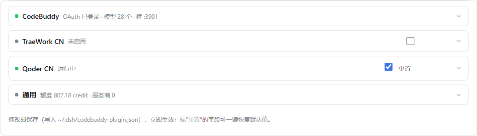
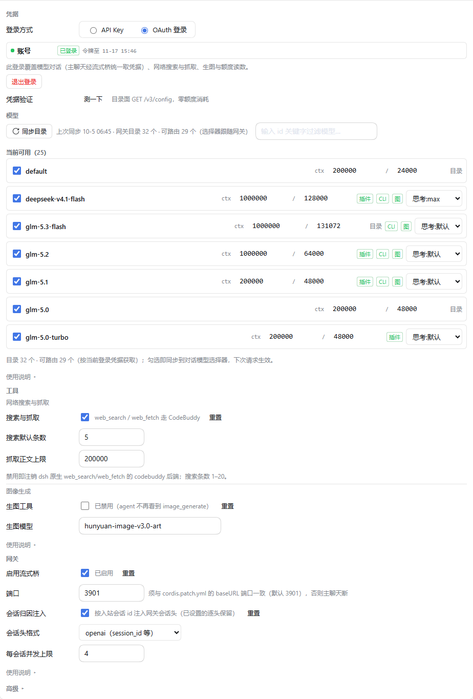

# dsh-tap

[](https://github.com/taikaikaikai-pixel/dsh-tap/actions/workflows/node.js.yml)
[](https://github.com/taikaikaikai-pixel/dsh-tap/releases)
[](LICENSE)


English | [中文文档](README.md)

Turn your **CodeBuddy (Tencent) / TRAE SOLO CN (ByteDance) / Qoder CN (Alibaba) subscription quota** into 20+ selectable models inside [DeepSeek Harness (dsh)](https://github.com/deepseek-ai/deepseek-harness) — one browser sign-in from the settings card, no environment variables. Also ships a key-type OpenAI-compatible provider registry (Volcengine Ark, Alibaba Bailian, DeepSeek, Zhipu BigModel, Moonshot AI, OpenRouter, Qwen Code), web search/fetch backends, image generation and per-model reasoning effort, all managed from a 4-block accordion settings card.



## Is this for you?

**Yes**, if you use dsh (CLI or desktop) and hold any of the accounts above — the plugin connects **your own** subscriptions and API keys; it ships no accounts and no free quota. Any one channel is enough to get started, or just an OpenAI-compatible API key.

**No**, if you don't use dsh: this is a dsh plugin and is useless standalone. Install dsh first (see the official repository), then come back.

## Prerequisites

| Requirement | Notes |
|-------------|-------|
| [DeepSeek Harness (dsh)](https://github.com/deepseek-ai/deepseek-harness) | ≥ 0.1.6 (Plugin Manager); install per the official repo |
| Node | ≥ 22 (pure ESM, no build step) |
| An upstream account | Any one of CodeBuddy (OAuth or API key) / TRAE SOLO CN subscription / Qoder CN subscription; or any key-type OpenAI-compatible provider |

## Quick start

```sh
# From npm (prebuilt tarball, skips the allowBuilds approval)
dsh plugin --profile web add dsh-tap

# Or from GitHub (from source)
dsh plugin --profile web add github:taikaikaikai-pixel/dsh-tap
```

1. Restart the dsh process (desktop host: quit and relaunch the app).
2. Open the settings card: sidebar 「插件」→ Plugin Manager → dsh-tap.
3. Sign in from the channel block's **Credentials** group → models appear in the conversation model picker automatically.



Each channel runs a local loopback gateway (streaming bridge / OpenAI translation gateways on `127.0.0.1:3901/3902/3903`) that holds the only copy of your credentials. Tokens and keys are stored on your machine under `~/.dsh/` and are never sent to the browser (API keys only appear masked, `ck_a…5678`).

## Documentation

The in-depth documentation is maintained in [README.md](README.md) (Chinese): full model catalogue tables, TraeWork chat transports, provider registry, usage metering, streaming bridge settings and the development/verification suite. Engineering references live in `docs/` and `wiki/`. Troubleshooting entry points:

| Symptom | Doc |
|---------|-----|
| Trae channel error 3003 / inline transport down | `docs/diagnosis-trae-3003.md` |
| Low cache hit-rate / suspected duplicate billing | `docs/diagnosis-cache-quota.md`, `docs/diagnosis-cache-decline.md` |
| Qoder provider_error / Flash unavailable | `docs/diagnosis-qoder-flash.md` |
| Odd model/effort behavior after upgrade | `GET /dsh-tap/settings?probe=host-config` |

For anything else, open an [issue](https://github.com/taikaikaikai-pixel/dsh-tap/issues) (template provided) and include the `?probe=host-config` output.

## Disclaimer

Unofficial third-party open-source plugin. Not affiliated with, sponsored or endorsed by Tencent, ByteDance, Alibaba, DeepSeek or any model vendor; respective names and trademarks belong to their owners. Provided "as is", without warranty of any kind, under the [MIT](LICENSE) license. The upstream gateway interfaces are undocumented internal forms and may change or break at any time. Credentials are stored only on your machine under `~/.dsh/` — keep them out of any public repository.

## License

MIT
